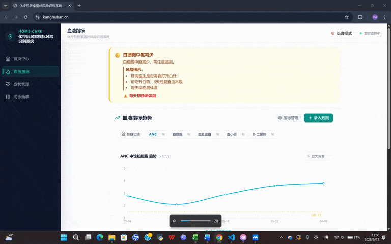

<div align="center">
  <h1>🏠 化疗居家风险提示工具</h1>
  <p>一个帮化疗患者在两次治疗之间，在家判断“要不要紧”的小工具。</p>
</div>

<div align="center">
  
  
  
</div>

<br>

<div align="center">
  <a href="[https://kanghuban.cn/]">
    
  </a>
  <p>👆 点击图片跳转在线 Demo（或 <a href="[https://kanghuban.cn/]">点这里</a>）</p>
</div>

---

## 这是什么

一个给肿瘤患者和家属用的居家风险提示工具。输入血常规指标和身体症状，系统对照公开的临床指南分级标准，给出绿/黄/红三种风险提示，并帮家属生成一段可以直接发给医生的病情描述。

**这个工具不给医疗建议，不推荐用药，不诊断。** 所有判断都在手机本地完成，不上传任何健康数据。

## 为什么会做这个

家里有亲人正在接受化疗。过去一年多的陪护里，最焦虑的往往不是住院期间，而是出院回家后的那几天——人有点低烧、刷牙带血丝、没力气，不知道该马上联系医生，还是“正常反应，观察一下”。身边没有医护，自己对着化验单也看不懂趋势。

市面上找到的工具，要么是大而全的肿瘤管理平台（功能多但反而没人坚持用），要么就是搜索引擎和病友群（信息不可靠且容易越界）。所以决定自己做一个小切口的东西：就盯住从这次化疗出院到下一次入院这个窗口期，只做风险识别和沟通辅助。

## 在线体验

👉 **[在线 Demo]([https://kanghuban.cn/])**

目前是模拟数据版本，可以完整走通：记录症状 → 查看风险提示 → 生成问诊描述。

## 主要功能

- **双模式**：长者模式（超大字体，两步完成操作）和标准模式（给家属用，能看指标趋势，能用问诊助手）
- **风险分级提示**：绿/黄/红三级，参考 CTCAE 和 CSCO 公开指南，提示语用“建议联系医生确认”，不做诊断性判断
- **问诊助手**：把零散的症状、指标、已采取措施，拼成一段医生容易看懂的话，长按复制
- **本地计算**：所有风险判断在手机本地跑，不上传化验数据。Supabase 只存症状记录和共享提醒，不含任何化验值

## 技术栈

```json
{
  "前端": "React 18 + Vite + TypeScript",
  "样式": "Tailwind CSS",
  "数据": "Supabase（仅非诊疗数据）",
  "部署": "腾讯云",
  "风险计算": "纯前端 JS 规则引擎（基于公开指南阈值）"
}
## 项目文档
- [产品需求文档 (PRD)](./PRD.md)
- [典型用户画像](./research/user_personas.md)
- [产品逻辑架构图](./assets/architecture.png)
- [数据与合规边界](./docs/data-boundary.md)
